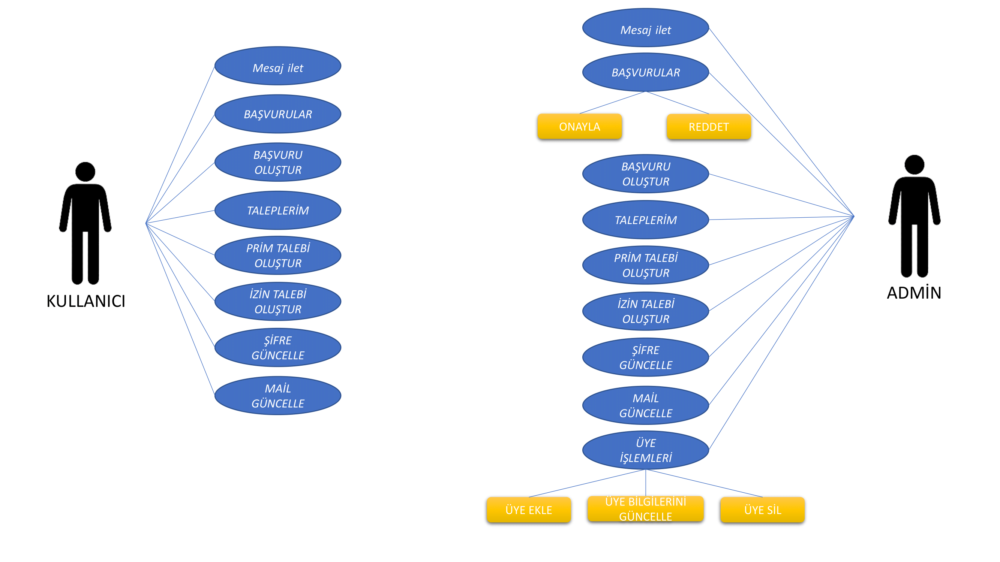

İnsan kaynakları bir çok şirketin sahip olduğu bir departmandır.Bu departman da bir çok departman gibi
bir otomasyon sistemine sahip olmalıdır.Bu kapsamda işe alım/işten çıkarma gibi işlemler, işe alım için gerekli
form uygulamaları gibi işlemleri kapsayan bir otomasyon sistemi tasarlıyoruz.Bu otomasyon sisteminde sistem 
kullanıcılarının bir mesaj kutusu da olacak.Bu sayede birbirleriyle otomasyon üzerinden haberleşebilecekler.

	Bu projenin diğer projelerden farkı otomasyonun aynı zamanda bir haberleşme ağı olabilmesidir.
Kişiler sahip oldukları mesaj kutusunda kendilerine gelen mesaj/ileti gibi gönderimle alabilecek 
ve bu gönderimleri yanıtlayabileceklerdir.

	Admin ve normal kullanıcı arayüzleri olacak
Kullanıcı arayüzü bir elemanı işe almak için gerekli formu doldurabilecek.Diğer kullanıcılara mesaj iletebilecek
ve yanıtlayabilecekken admin arayüzü bu işe alım formlarını değerlendirip onaylama/reddetme yetkisine sahip olabilecek
Aynı zamanda normal kullanıcının erişemediği veritabanına erişim sağlayabilecek.Bu veritabanı kullanıcılarla
alakalı bilgiler içerecek.Örneğin kullanıcının adı,soyadı,tc kimlik numarası,mevcut konumu,maaşı vs.
Bu erişimle beraber mevcut kullanıcıların bilgilerini güncelleyebilecek,kullanıcı kayıtlarını silebilecek 
veya yeni kayıt ekleyebilecek.

Bu otomasyon geliştirilirken C# ve MsSQL dilleri kullanılacaktır.

	
	PROJEYE KATILAN ÖĞRENCİLER
	
	192503035 - VEYSEL GÜVEN PARLAK - Veritabanı 
	192503024 - OKAN ALPTÜRK - C# 	
	192503034 - ABDULKADİR GÜLTEKİN	- Arayüz ve Form Tasarımı	
	
	USE CASE DİAGRAMI 
	
	
	

	
	

